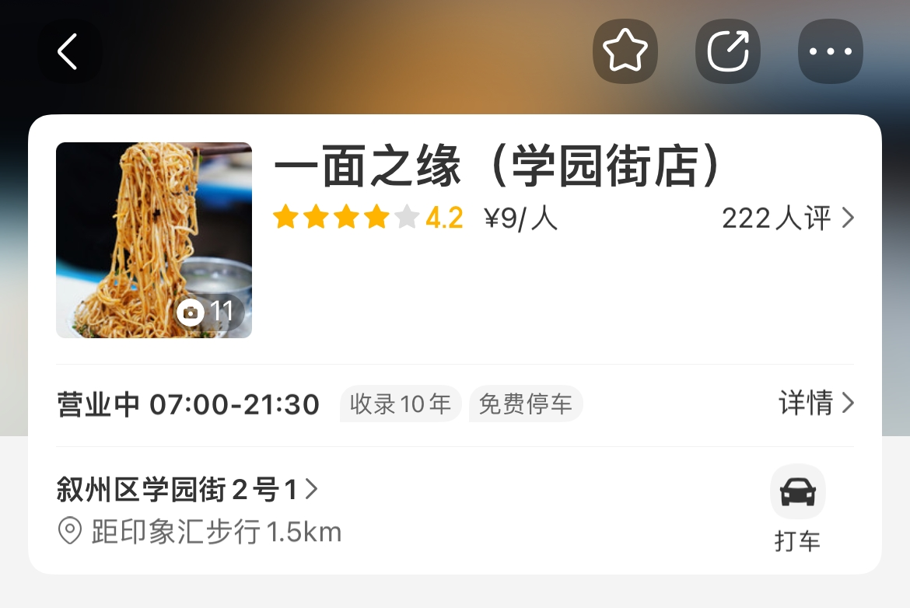
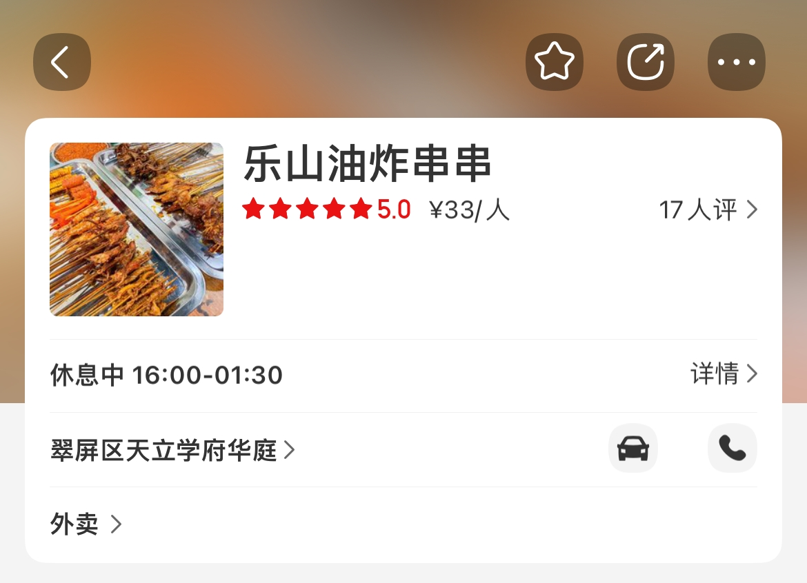
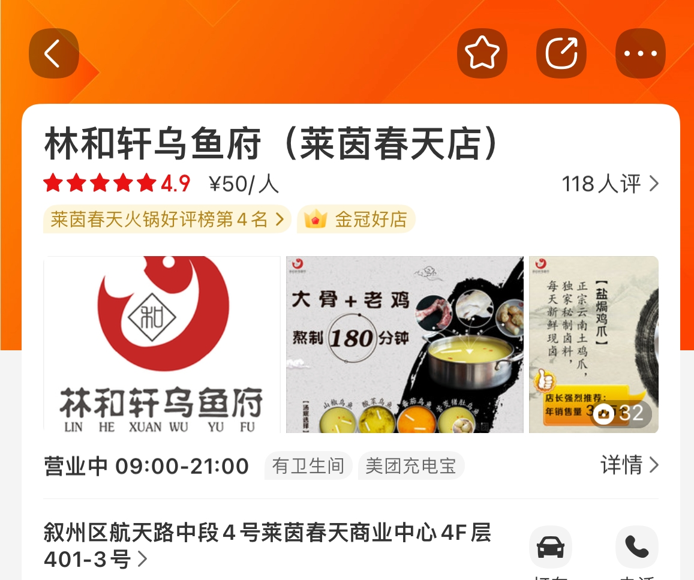
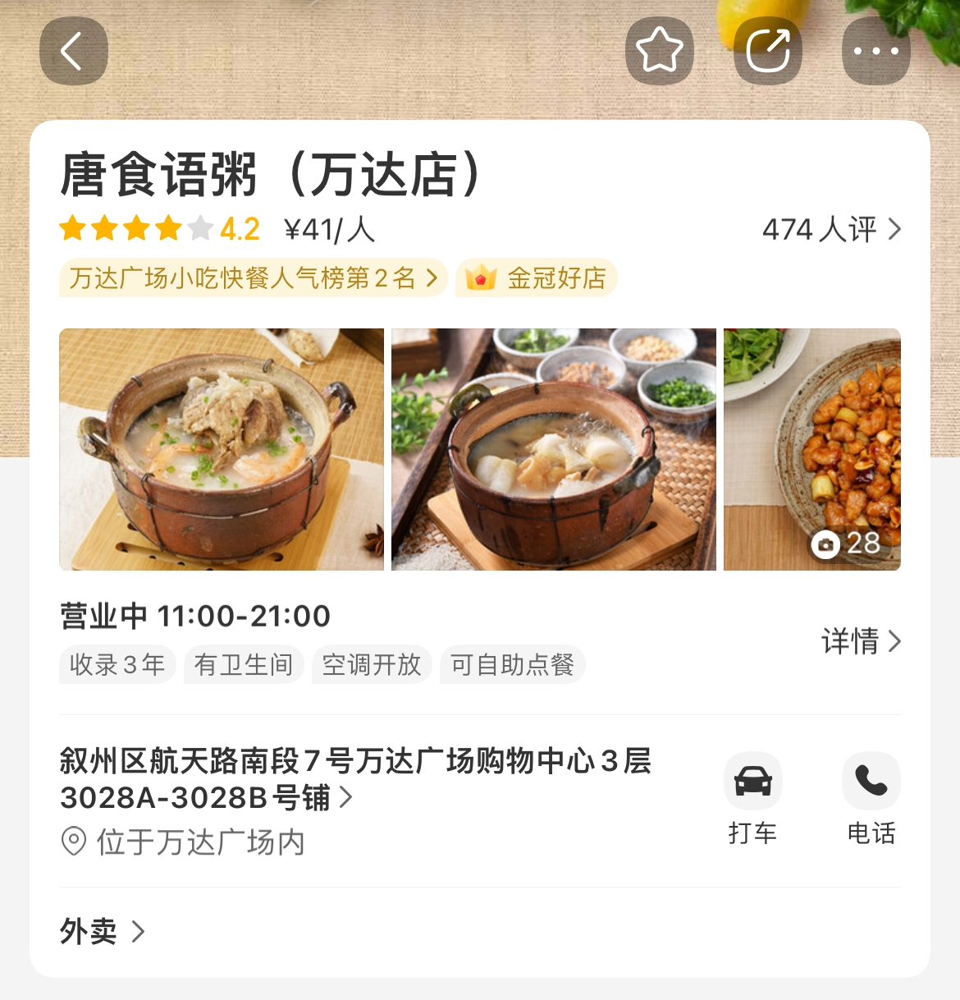
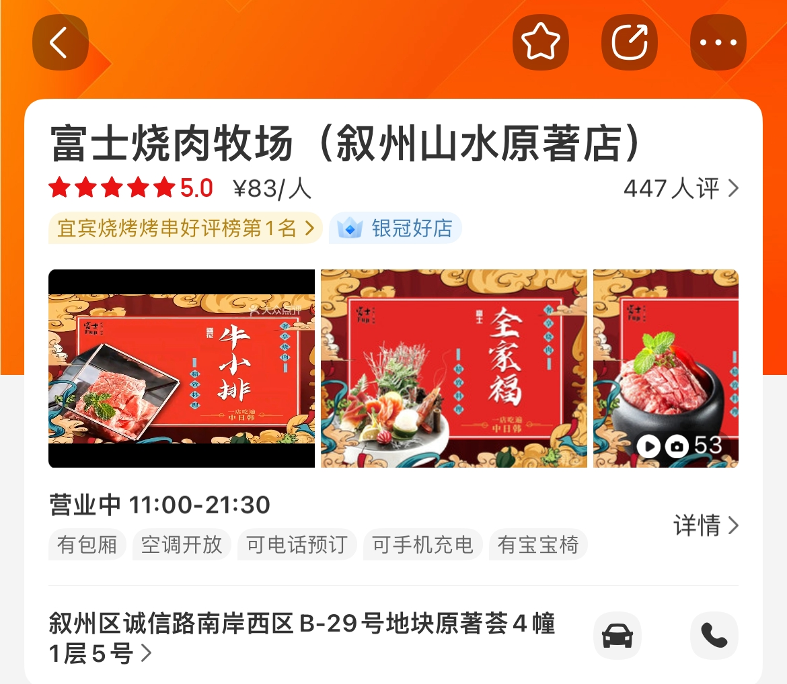
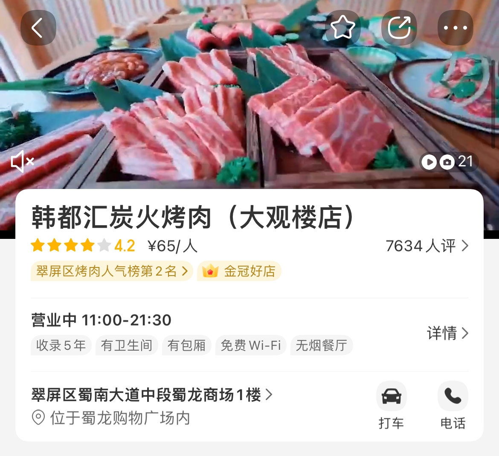

# 宜宾
## 食
---
评分标准：爬取了美团、大众点评、小红书的数据（饿了么未开放接口因此本次未能收入，数据截止到2021-12-07），每个平台占比均分别为25%，50%.25%（小红书会根据点赞数归一化处理后进行相加,客观来说大众点评仍是最权威的点评平台因此权重最大）,若商家未入驻某平台则按照则按照及格分数3.0进行相加，只针对单品餐厅，全国大型连锁餐厅不在考虑情况中。
### 地方特色菜
1. 麻辣空间.清油火锅
+ 美团4.6，大众点评4.9，小红书未上取3.0，最终得分4.35
+ 较为小型的连锁火锅店，无功无过，踩坑可能性小。

2. 林二哥烧烤
+ 美团4.0，大众点评4.0，小红书754喜欢归一取5.0，最终得分4.25
+ 典型的小店，但比较正宗的宜宾烧烤。

3. 一面之缘
+ 美团4.2，大众点评4.0，小红书113喜欢归一取4.0，最终得分4.05
+ 也是小店，酸萝卜面评价很高。

4. 乐山油炸串串
+ 美团5，大众点评3.6，小红书未上取3.0，最终得分4
+ 小店，存在美团刷单嫌疑，考虑到与乐山的距离，或许比较正宗。

5. 川西火焰山火盆烧烤
+ 美团4.9，大众点评3.8，小红书未上取3.0，最终得分3.875
+ 较大的店，炭火烤肉熟的速度会慢一些。

### 中餐
1. 林和轩乌鱼府
+ 美团4.9，大众点评4.8，小红书1171喜欢归一取5.0，最终得分4.875
+ 很多博主推荐的店，据说不是清淡口而是泡椒小辣口味。

2. 乔家小厨
+ 美团4.9，大众点评4.3，小红书3喜欢归一取3.0，最终得分4.675
+ 较大型川菜店，无功无过吧。

3. 唐食语粥
+ 美团4.8，大众点评3.9，小红书121喜欢归一取4.0，最终得分4.4
+ 大型粥类连锁了，偶尔换换口味也不错，**还提供外卖**。

### 外餐
1. 富士烧肉牧场
+ 美团5，大众点评3.7，小红书242喜欢归一取5.0，最终得分4.35
+ 普通的日式烤肉吧，价格偏贵。

2. 龙山烤肉
+ 美团4.9，大众点评3.7，小红书231喜欢归一取5.0，最终得分4.35
+ 望江校区外面就有，日式烤肉环境可以，价格也是偏贵。

3. 韩都汇炭火烤肉
+ 美团4.2，大众点评4.8，小红书56喜欢归一取4.0，最终得分4.45
+ 韩式烤肉，价格会相对有好一些。

## 外卖
+ 定位地点为川大宜宾园区，综合美团、饿了么外卖数据得出，同样全国连锁大型餐厅不在考虑范围内（奶茶还是很多家的，茶百道什么都有哈哈哈）：
+ 还是都挺健康的哈，宜宾沙拉回购第一名

+ 宜宾冒菜好评第一名

+ 东北人还是对饺子有执念啊

+ 都是品牌中餐，评分评价看起来都还好

---
## 喝
---
+ 基本的奶茶店都有（瑞幸不支持配送外卖），这里列举一些精品咖啡店：
+ 五粮液dirty
+ + 宜宾的咖啡怎么能没有五粮液
+ + [五粮液dirty](http://xhslink.com/uNJEZe)
+ Foam Coffee
+ + 同样是五粮液入股
+ + [FoamCoffee]( http://xhslink.com/w2WEZe)
---

## 玩&乐
+ 主要参考携程、大众点评的数据，以及个人的一些私心哈哈哈~
+ [五粮液酒厂](https://m.ctrip.com/webapp/you/gspoi/sight/278/49794.html?seo=0&ishidenavbar=yes&popup=close&autoawaken=close&scene=basic&s_guid=05FFD5B5-A559-4651-A494-2BD5DA7AC970
)
+ + 虽然不喝但对这个还是很感兴趣，
+ [蜀南竹海](https://m.ctrip.com/webapp/you/gspoi/sight/3114/18674.html?seo=0&ishidenavbar=yes&popup=close&autoawaken=close&scene=basic&s_guid=9036E4D5-A174-4FAA-82D0-5F19EF5AC6A0
)
+ + 只是觉得夏天在竹林里喝茶应该不错。
+ [宜宾三江游船](https://m.ctrip.com/webapp/you/gspoi/sight/278/5713248.html?seo=0&ishidenavbar=yes&popup=close&autoawaken=close&scene=basic&s_guid=3092CD09-A7B8-490D-A531-B23FED06DA1B
)
+ + 因水而生，了解的最好方式就是溯流而上吧。
